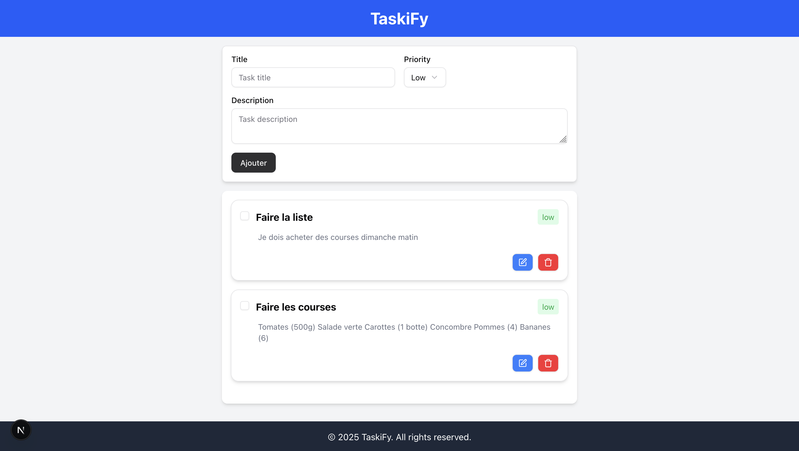
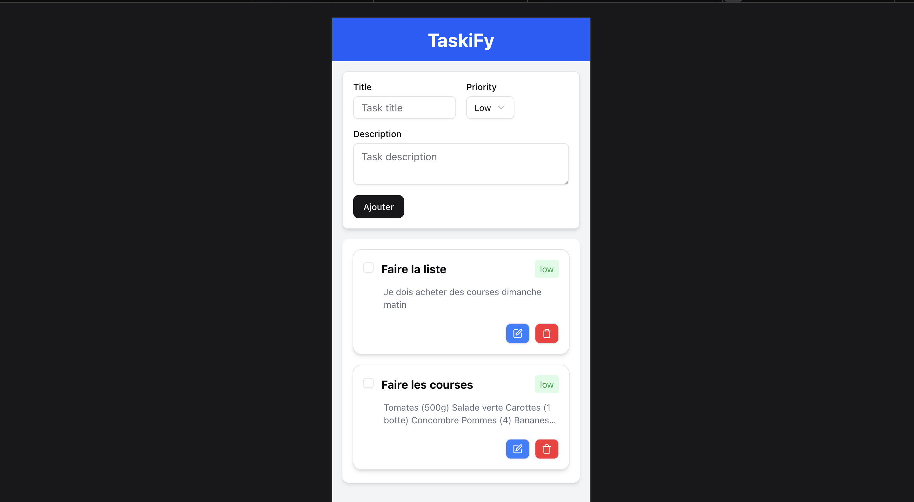

# TaskiFy - Application de Gestion de Tâches

[Visitez le site TaskiFy](https://todolist-nextjs-nine-phi.vercel.app)


## 📋 Présentation

TaskiFy est une application moderne de gestion de tâches construite avec Next.js et TypeScript. Elle permet aux utilisateurs de créer, organiser, modifier et suivre leurs tâches quotidiennes avec une interface utilisateur élégante et responsive.




## Objectif

Cette application a été développée dans le but d'avoir une nouvelle compétence à mon arc. L'objectif était d'apprendre et de se familiariser assez rapidement avec l'écosystème de Next JS.

## ✨ Fonctionnalités

Gestion complète des tâches : Création, modification, suppression et marquage des tâches comme terminées
Système de priorité : Classement des tâches par niveaux de priorité (faible, moyen, élevé)
Interface responsive : Expérience utilisateur optimisée sur ordinateur, tablette et mobile
Interaction en temps réel : Mises à jour instantanées de l'interface utilisateur grâce à React Query
Design moderne : UI élégante avec Tailwind CSS et Shadcn UI
Architecture optimisée : API Routes de Next.js pour des interactions serveur efficaces

## 🚀 Installation et démarrage

```json
# Cloner le dépôt
git clone https://github.com/yourusername/taskify.git
cd taskify

# Installer les dépendances
npm install
# ou
yarn install

# Configurer les variables d'environnement
cp .env.example .env.local
# Remplir les variables d'environnement nécessaires

# Lancer les migrations Prisma
npx prisma migrate dev

# Démarrer l'application en mode développement
npm run dev
# ou
yarn dev

```

## 🏗️ Structure du projet

```json
taskify/
├── app/                   # Routes et pages Next.js
│   ├── api/               # API routes
│   └── page.tsx           # Page d'accueil
├── components/            # Composants React réutilisables
│   ├── TaskForm.tsx       # Formulaire de création de tâche
│   ├── TaskItem.tsx       # Composant individuel de tâche
│   ├── TaskList.tsx       # Liste des tâches
│   └── EditTaskModal.tsx  # Modal pour éditer les tâches
├── hooks/                 # Custom React hooks
│   └── use-tasks.ts       # Hooks pour la gestion des tâches
├── lib/                   # Utilitaires et configurations
│   ├── prisma.ts          # Client Prisma
│   └── instance.ts        # Configuration Axios
├── services/              # Services API
│   └── tasks.ts           # Fonctions d'appel API pour les tâches
├── types/                 # Définitions TypeScript
│   └── tasks.ts           # Types pour les tâches
└── prisma/                # Configuration Prisma et schémas
    └── schema.prisma      # Schéma de base de données
```

## 📱 Fonctionnalités détaillées

Gestion des tâches

Création de tâches : Ajoutez des nouvelles tâches avec titre, description et niveau de priorité
Modification : Mettez à jour les informations des tâches existantes via une modal intuitive
Suppression : Supprimez les tâches devenues obsolètes
Marquage de complétion : Indiquez l'état d'avancement de vos tâches
Visualisation flexible : Affichez ou masquez les descriptions longues avec l'option "Voir plus"

Interface utilisateur

Design adaptatif : S'adapte parfaitement à toutes les tailles d'écran
Indicateurs visuels : Codes couleur pour les différents niveaux de priorité
Interactions intuitives : Feedback visuel immédiat après chaque action
Notifications : Messages toast pour confirmer les actions réussies ou signaler les erreurs

## 🔗 API Endpoints

L'application expose les endpoints API suivants :

GET /api/tasks - Récupérer toutes les tâches
POST /api/tasks - Créer une nouvelle tâche
GET /api/tasks/:id - Récupérer une tâche par ID
PUT /api/tasks/:id - Mettre à jour une tâche existante
PATCH /api/tasks/:id - Mettre à jour le statut de complétion d'une tâche
DELETE /api/tasks/:id - Supprimer une tâche

## 🧩 Technologies utilisées

Frontend : React, Next.js, TypeScript, Tailwind CSS, Shadcn UI
State Management : React Query, React Hooks
Backend : Next.js API Routes
Base de données : MongoDB avec Prisma ORM
Communication API : Axios
Déploiement : Vercel (recommandé)

## 🤝 Contribution

Les contributions sont les bienvenues ! N'hésitez pas à ouvrir une issue ou à soumettre une pull request.

Fork du projet

Création d'une branche (git checkout -b feature/amazing-feature)
Commit des modifications (git commit -m 'Add amazing feature')
Push vers la branche (git push origin feature/amazing-feature)
Ouverture d'une Pull Request

## 📄 Licence

Distribué sous la licence MIT. Voir LICENSE pour plus d'informations.

© 2025 TaskiFy. Tous droits réservés.
